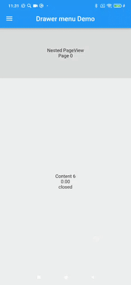

<div align="center" style="text-align:center">
<h1 align="center">Drawer menu</h1>
</div>

Simple drawer menu solution for flutter that you can use for navigation in your application.

Drawer menu is a menu that is usually located on the left of the page and can used for navigation or other things.

The menu is displayed by swiping from any part of the primary content. The primary content is shifted with a parallax effect.
It supports horizontal scrolling in nested widgets and intercepts OverscrollNotification to move the menu accordingly.

It can also work in tablet mode if the widget's width is greater than 600dp.

| Android                             | iOS                             |
| -------------------------------- | ----------------------------------- |
|  |  |

| Tablet mode                              |
| --------------------------------- |
|  |

## Usage

##### 1. add dependencies into you project pubspec.yaml file

```yaml
dependencies:
  flutter_drawer_menu: ^0.1.0
```

Run `flutter packages get` in the root directory of your app.

##### 2. import flutter_drawer_menu lib

```dart
import 'package:flutter_drawer_menu/drawer_menu.dart';
```

Now you can use `DrawerMenu` as a widget in your code.

##### 3. use DrawerMenu

If you want to manage the state of the `DrawerMenu` or subscribe to events, you need to create a `DrawerMenuController`.

```dart
final _controller = DrawerMenuController();
```

Creating the menu.

```dart
DrawerMenu(
  controller: _controller,
  menu: _buildMenu(),
  body: _buildBody(),
);
```

If you want to configure a transparent navigation bar for Android the same way as in the example, you need to call the following once (e.g., in `initState`):
```dart
SystemChrome.setEnabledSystemUIMode(SystemUiMode.edgeToEdge);
```
and set the fields of `SystemUiOverlayStyle`:
```dart
systemNavigationBarColor: Colors.transparent,
systemNavigationBarContrastEnforced: false,
```

How to manage DrawerMenu.
```dart
_controller.open(animated: true);
_controller.close(animated: true);
_controller.toggle(animated: true);
```

You can subscribe to state change events isOpen, scrollPosition, isTablet using the controller.
```dart
ValueListenableBuilder<bool>(
  valueListenable: _controller.isOpenNotifier,
  builder: (context, value, _) {
    return Text(value ? "open": "closed");
  }
)
```

#### DrawerMenu Props

| props                    |         types          |                                   description                                   |
| :----------------------- | :--------------------: | :-----------------------------------------------------------------------------: |
| animationDuration        |      `Duration`        | Duration of (open/closed) toggling animation (default 300ms)                    |
| tabletModeMinScreenWidth |    `double`            |The minimum width of the DrawerMenu to activate tablet mode (show side menu).    |
| tabletModeSideMenuWidth  |       `double`         |        The width of the side menu in tablet mode        |
| rightMargin              |       `double`         |      Right margin for the menu. Default is 70.       |
| controller               | `DrawerMenuController?`|Control tool for DrawerMenu behavior. It also allows subscribing to events for DrawerMenu state changes.|
| scrimColor            |        `Color?`        | Set a color to use for the scrim that obscures primary content while a drawer is open. Default is Color(0x44ffffff).             |
| scrimBlurEffect        |        `bool`        | Applies a blur effect when opening the menu. Default is False.                      |
| shadowColor      |        `Color?`        | Color for the right menu shadow. Default is Color(0x22000000).                     |
| shadowWidth          |        `double`        |Width for the right menu shadow. Default is 35.                         |
| bodyParallaxFactor   |      `double`      | Multiplier for the parallax effect applied to the body when the menu is opened. 0 - the body moves together with the menu. 1 - the body stays in place. Default is 0.5.                   |
| useRepaintBoundaries |      `bool`      | Use `RepaintBoundary` to isolate the rendering of the menu and body widgets for improve repaints performance. Default is True.                 |

---

## Full example:

```dart
import 'package:flutter/services.dart';
import 'package:flutter_drawer_menu/drawer_menu.dart';
import 'package:flutter/material.dart';

void main() {
  runApp(const MyApp());
}

class MyApp extends StatelessWidget {
  const MyApp({Key? key}) : super(key: key);

  @override
  Widget build(BuildContext context) {
    return MaterialApp(
      title: 'Drawer menu Demo',
      theme: ThemeData(
        primarySwatch: Colors.blue,
      ),
      home: const MyHomePage(title: 'Drawer menu Demo'),
      debugShowCheckedModeBanner: false,
    );
  }
}

class MyHomePage extends StatefulWidget {
  const MyHomePage({Key? key, required this.title}) : super(key: key);

  final String title;

  @override
  _MyHomePageState createState() => _MyHomePageState();
}

class _MyHomePageState extends State<MyHomePage> {

  final _controller = DrawerMenuController();
  int _selectedContent = 0;

  @override
  void initState() {
    SystemChrome.setEnabledSystemUIMode(SystemUiMode.edgeToEdge);
    super.initState();
  }

  @override
  Widget build(BuildContext context) {
    return DrawerMenu(
      controller: _controller,
      menu: _buildMenu(),
      body: _buildBody(),
    );
  }

  Widget _buildMenu() {
    final listView = ListView.builder(
        itemBuilder: (context, index) {
          return InkWell(
            child: Padding(
              padding: const EdgeInsets.all(16.0),
              child: Text("Content $index"),
            ),
            onTap: () {
              _controller.close();
              setState(() {
                _selectedContent = index;
              });
            },
          );
        }
    );

    Widget menu = Container(
      color: Colors.white,
      child: SafeArea(
        child: listView,
      ),
    );

    // Applying status bar and navigation bar theme settings.
    // If you want to configure a transparent navigation bar for Android
    // the same way as in the example, you need to call the following once (e.g., in initState):
    // SystemChrome.setEnabledSystemUIMode(SystemUiMode.edgeToEdge);
    // and set the fields of SystemUiOverlayStyle:
    // systemNavigationBarColor: Colors.transparent,
    // systemNavigationBarContrastEnforced: false,
    menu = AnnotatedRegion<SystemUiOverlayStyle>(
      value: const SystemUiOverlayStyle(
        // Android part.
        statusBarColor: Colors.transparent,
        statusBarIconBrightness: Brightness.dark,
        systemNavigationBarColor: Colors.transparent,
        systemNavigationBarContrastEnforced: false,
        systemNavigationBarIconBrightness: Brightness.dark,
        // iOS part.
        // When Android setup dark iOS light one. Hmm.
        statusBarBrightness: Brightness.light,
      ),
      child: menu,
    );

    return menu;
  }

  Widget _buildBody() {
    // The menu button subscribes to changes in the menu mode (tablet|phone).
    Widget leadingWidget = ValueListenableBuilder<bool>(
        valueListenable: _controller.isTabletModeNotifier,
        builder: (context, value, _) {
          if(value) {
            return const SizedBox();
          }
          return IconButton(
            icon: const Icon(Icons.menu),
            onPressed: () {
              _controller.open();
            },
          );
        }
    );

    /// PageView part
    Widget pageView = Container(
      color: Colors.black12,
      height: 150,
      child: PageView.builder(
        physics: const ClampingScrollPhysics(),
        itemBuilder: (context, index) => Center(
          child: Text(
            "Nested PageView\nPage $index",
            textAlign: TextAlign.center,
          ),
        ),
      ),
    );

    /// Content part
    Widget content = Expanded(
      child: Container(
        color: Colors.black.withOpacity(0.05),
        child: Center(
          child: Column(
            mainAxisAlignment: MainAxisAlignment.center,
            children: [
              Text("Content $_selectedContent"),
              // scrollPosition subscription (0-1)
              ValueListenableBuilder<double>(
                  valueListenable: _controller.scrollPositionNotifier,
                  builder: (context, value, _) {
                    return Text(value.toStringAsFixed(2));
                  }
              ),
              // isOpen subscription
              ValueListenableBuilder<bool>(
                  valueListenable: _controller.isOpenNotifier,
                  builder: (context, value, _) {
                    return Text(value ? "open": "closed");
                  }
              ),
            ],
          ),
        ),
      ),
    );

    return Scaffold(
      appBar: AppBar(
        title: Text(widget.title),
        centerTitle: true,
        leading: leadingWidget,
      ),
      body: Column(
        children: [
          pageView,
          content
        ],
      ),
    );
  }
}
```

Feel free to fork this repository and send pull request 🏁👍
